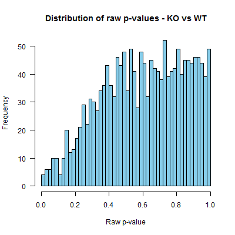
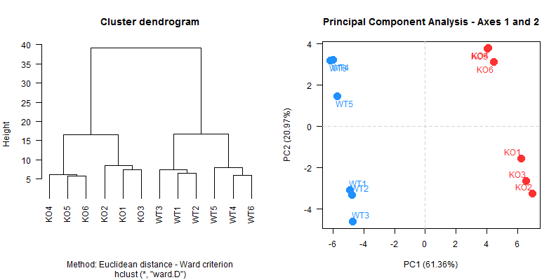
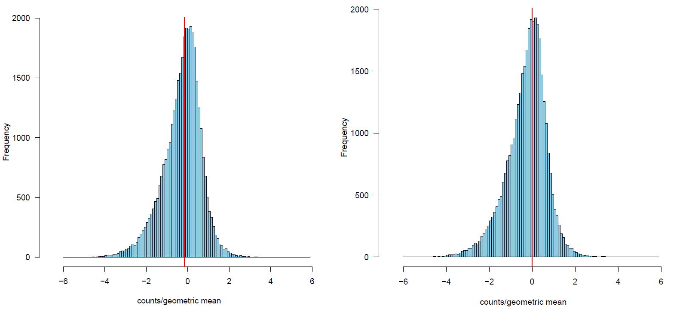

<!--
%\VignetteEngine{knitr::knitr}
\usepackage[utf8]{inputenc}
%\VignetteIndexEntry{tutorial}
-->

# SARTools vignette for the differential analysis of 2 or more conditions with DESeq2 or edgeR

SARTools version: `r packageVersion("SARTools")`

Authors: M.-A. Dillies and H. Varet (hugo.varet@pasteur.fr) - Transcriptome and Epigenome Platform, Institut Pasteur, Paris

Website: https://github.com/PF2-pasteur-fr/SARTools

## 1 Introduction

This document aims to illustrate the use of the SARTools R package in order to compare two or more biological conditions in a RNA-Seq framework. SARTools provides tools to generate descriptive and diagnostic graphs, to run the differential analysis with one of the well known DESeq2 [1,2] or edgeR [3] packages and to export the results into easily readable tab-delimited files. It also facilitates the generation of a HTML report which displays all the figures produced, explains the statistical methods and gives the results of the differential analysis. Note that SARTools does not intend to replace DESeq2 or edgeR: it simply provides an environment to go with them. For more details about the methodology behind DESeq2 and edgeR, the user should read their documentations and papers. 

SARTools is distributed with two R script templates which use functions of the package. For a more fluid analysis and to avoid possible bugs when creating the final HTML report, the user is encouraged to use them rather than writing a new script. 

The next section details the tools and files required to perform an analysis and the third section explains the different steps of the analysis. Section 4 gives some examples of problems which can occur during an analysis and section 5 provides command lines to run a toy example of the workflow.

## 2 Prerequisites

### 2.1 R tools

In addition to the SARTools package itself, the workflow requires the installation of several packages: DESeq2, edgeR, genefilter, xtable and knitr (all available online). SARTools needs R version 3.1.0 or higher, DESeq2 1.6.0 or higher and edgeR 3.8.5 or higher: old versions of DESeq2 or edgeR may be incompatible with SARTools.

The only file the user has to deal with for an analysis is either `template_script_DESeq2.r` or `template_script_edgeR.r` (supplied within the package). They contain all the code needed for the statistical analysis, and to generate figures, tables and the HTML report.

### 2.2 Data files

The statistical analysis assumes that reads have already been mapped and that counts per feature (gene or transcript) are available. If counting has been done with HTSeq-count [4], output files are ready to be loaded in R with the dedicated SARTools function. If not, the user must supply one count file per sample with two tab delimited columns without header:

 - the unique IDs of the features in the first column;
 - the raw counts associated with these features in the second column (null or positive integers).

All the count data files have to be placed in a directory whose name will be passed as a parameter at the beginning of the R script. 

The user has to supply another tab delimited file which describes the experiment, i.e. which contains the name of the biological condition associated with each sample. This file is called "target" as a reference to the target file needed when using the limma package [5]. This file has one row per sample and is composed of at least three columns with headers: 

 - first column: unique names of the samples (short but informative as they will be displayed on all the figures);
 - second column: name of the count files;
 - third column: biological conditions;
 - optional columns: further information about the samples (day of library preparation for example).

The table below shows an example of a target file:

| label | files                        | group |
|:------|:-----------------------------|:------|
| s1c1  | count_file_sample1_cond1.txt | cond1 |
| s2c1  | count_file_sample2_cond1.txt | cond1 |
| s1c2  | count_file_sample1_cond2.txt | cond2 |
| s2c2  | count_file_sample2_cond2.txt | cond2 |

Warning: if the counts and the target files are not supplied in the required formats, the workflow will probably crash and will not be able to run the analysis.

## 3 Running the analysis

### 3.1 Setting the parameters

All the parameters that can be modified by the user are at the beginning of the R template files:

 - `workDir`: path to the working directory for the R session (must be supplied by the user);
 - `projectName`: name of the project (must be supplied by the user);
 - `author`: author of the analysis (must be supplied by the user);
 - `targetFile`: path to the target file (`"target.txt"` by default);
 - `rawDir`: path to the directory where the counts files are stored (`"raw"` by default);
 - `featuresToRemove`: character vector containing the IDs of the features to remove before running the analysis (default are `"alignment_not_unique"`, `"ambiguous"`, `"no_feature"`, `"not_aligned"`, `"too_low_aQual"` to remove HTSeq-count specific rows);
 - `varInt`: variable of interest, i.e. biological condition, in the target file (`"group"` by default);
 - `condRef`: reference biological condition used to compute fold-changes (no default, must be one of the levels of `varInt`);
 - `batch`: adjustment variable to use as a batch effect, must be a column of the target file (`NULL` if no batch effect needs to be taken into account);
 - `fitType`: (if use of DESeq2) type of model for the mean-dispersion relationship (`"parametric"` by default, or `"local"`);
 - `cooksCutoff`: (if use of DESeq2) `TRUE` (default) of `FALSE` to execute or not the detection of the outliers [6];
 - `independentFiltering`: (if use of DESeq2) `TRUE` (default) of `FALSE` to execute or not the independent filtering [7];
 - `alpha`: significance threshold applied to the adjusted p-values to select the differentially expressed features (default is `0.05`);
 - `pAdjustMethod`: p-value adjustment method for multiple testing (`"BH"` by default, `"BY"` or any value of `p.adjust.methods`) [8,9];
 - `typeTrans`: (if use of DESeq2) method of transformation of the counts for the clustering and the PCA (default is `"VST"` for Variance Stabilizing Transformation, or `"rlog"` for Regularized Log Transformation);
 - `locfunc`: (if use of DESeq2) function used for the estimation of the size factors (default is `"median"`, or `"shorth"` from the genefilter` package);
 - `cpmCutoff`: (if use of edgeR) counts-per-million cut-off to filter low counts (default is 1, set to 0 to disable filtering);
 - `gene.selection`: (if use of edgeR) method of selection of the features for the MultiDimensional Scaling plot (`"pairwise"` by default or `common`);
 - `normalizationMethod`: (if use of edgeR) normalization method in `calcNormFactors()`: `"TMM"` (default), `"RLE"` (DESeq method) or `"upperquartile"`;
 - `colors`: colors used for the figures (one per biological condition), 4 are given by default.


All these parameters will be saved and written at the end of the HTML report in order to keep track of what has been done.

### 3.2 Executing the script

When the parameters have been defined, the user can run all the R code, either step by step or in one block. The command lines use functions of the SARTools package to load data, to produce figures, to perform the differential analysis, to export the results and to create the HTML report. Some results and potential warning/error messages will be printed in the R console:

 - target with the count files loaded and the biological condition associated with each sample;
 - number of features and null counts in each file;
 - top and bottom of the count matrix;
 - SERE coefficients computed between each pair of samples [10];
 - normalization factors (TMM for edgeR and size factors for DESeq2);
 - number of features discarded by the independent filtering (if use of DESeq2);
 - number of differentially expressed features.

If the R code was executed in one block, the user should have a look at the console at the end of the analysis to check that the analysis ran without any problem.

### 3.3 Files generated

While running the script, PNG files are generated in the `figures` directory:

 - `barplotTC.png`: total number of reads per sample;
 - `barplotNull.png`: percentage of null counts per sample;
 - `densplot.png`: estimation of the density of the counts for each sample;	
 - `majSeq.png`: percentage of reads caught by the feature having the highest count in each sample;
 - `pairwiseScatter.png`: pairwise scatter plot between each pair of samples and SERE values;
 - `diagSizeFactorsHist.png`: diagnostic of the estimation of the size factors (if use of DESeq2);
 - `diagSizeFactorsTC.png`: plot of the size factors vs the total number of reads (if use of DESeq2);
 - `countsBoxplot.png`: boxplots on raw and normalized counts;	
 - `cluster.png`: hierachical clustering of the samples (based on VST or rlog data for DESeq2, or CPM data for edgeR);
 - `PCA.png`: first and second factorial planes of the PCA on the samples based on VST or rlog data (if use of DESeq2);
 - `MDS.png`: Multi Dimensional Scaling plot of the samples (if use of edgeR);
 - `dispersionsPlot.png`: graph of the estimations of the dispersions and diagnostic of log-linearity of the dispersions (if use of DESeq2);
 - `BCV.png`: graph of the estimations of the tagwise, trended and common dispersions (if use of edgeR);
 - `rawpHist.png`: histogram of the raw p-values for each comparison;
 - `MAplot.png`: MA-plot for each comparison (log ratio of the means vs intensity);
 - `volcanoPlot.png`: vulcano plot for each comparison ($-\log_{10}\text{(adjusted P value)}$ vs log ratio of the means).

Some tab-delimited files are exported in the `tables` directory. They store information on the features as $\log_2\text{(FC)}$ or p-values and can be read easily in a spreadsheet:

 - `TestVsRef.complete.txt`: contains all the features studied;
 - `TestVsRef.down.txt`: contains only significant down-regulated features, i.e. less expressed in Test than in Ref;
 - `TestVsRef.up.txt`: contains only significant up-regulated features i.e. more expressed in Test than in Ref.

A `.RData` file with all the R objects created during the analysis is saved: it may be used to perform downstream analyses. Finally, a HTML report which explains the full analysis is produced. Its goal is to give details about the methodology, the different steps and the results. It displays all the figures produced and the most important results of the differential analysis as the number of up- and down-regulated features. The user should read the full HTML report and closely analyze each figure to check that the analysis ran smoothly. 

Note that the HTML report is stand alone and can be shared without the source figure files. It makes the report easily sendable via e-mail for instance.

## 4 Troubleshooting RNA-seq experiments with SARTools

This section aims at listing some problems that the user can face when analyzing data from a RNA-Seq experiment.

### 4.1 Inversion of samples
For a variety of reasons, it might happen that some sample names are erroneously switched at a step of the experiment. This can be detected during the statistical analysis in several ways. Here, we have intentionally inverted two file names in a target file, such that the counts associated with these two samples (WT3 and KO3) are inverted. 

The first tool to detect the inversion is the SERE statistic [10] since its goal is to measure the similarity between samples. The SERE values obtained are displayed on the lower triangle of the figure 1. We clearly observe that KO3 is more similar to WT1 (SERE=1.7) than to KO2 (3.4), which potentially reveals a problem within the samples under study. The same phenomenon happens with WT3 which is more similar to KO1 (1.6) than to WT1 (4.59).


Figure 1: pairwise scatter plot and SERE statistics when inverting samples.

The clustering can also help detect such an inversion of samples. Indeed, on the dendrogram, samples from the same biological condition are supposed to cluster together while samples from two different biological conditions should group only at the final step of the algorithm. Figure 2 (left) shows the dendrogram obtained: we can see that KO3 clusters immediately with WT1 and WT2 while WT3 clusters with KO1 and KO2. 

The Principal Component Analysis on the right panel of figure 2 (or the Multi-Dimensional Scaling plot) is a tool which allows exploration of the structure of the data. Samples are displayed on a two dimensional graph which can help the user to assess the distances between samples. The PCA presented here leads to the same conclusion as the dendrogram. 


Figure 2: clustering dendrogram (left) and PCA (right) when inverting samples.

Finally, when testing for differential expression, if two samples have been inverted during the process, the histogram of the raw p-values can have an unexpected shape. Instead of having a uniform distribution, with a possible peak at 0 for the differentially expressed features, the distribution may be skewed toward the right (figure 3).



Figure 3: raw p-values histogram when inverting samples.

### 4.2 Batch effect
A batch effect is a source of variation in the counts due to splitting the whole sample set into subgroups during the wet-lab part of the experiment. To illustrate this phenomenon, figure 4 shows the results of the clustering and of the PCA for an experiment with 12 samples: 6 WT and 6 KO labeled from 1 to 6 within each condition. 



Figure 4: clustering dendrogram (left) and PCA (right) with a batch effect.

The first axis of the PCA, which catches 64.36% of the variability, clearly separates WT samples from KO samples. However, we can see that the second axis separates samples labeled 1, 2 and 3 from samples labeled 4, 5 and 6 with a large percentage of variability (20.97%). The clustering brings to the same conclusion: samples 1, 2 and 3 seem slightly different from samples 4, 5 and 6, both within WT and KO. 

After a return to the conditions under which the experiment has been conducted, it has been found that the first three samples were not prepared on the same day as the last three ones (both for WT and KO). This is enough to create a batch effect. In that case, add a column to the target file reporting the day of preparation, set the `batch` parameter value to "day of preparation" and re-do the analysis. It will result in a better fit of the model and potentially a gain of power when testing for differentially expressed features.

Warning: batch effects can be taken into account only if they do not confound with another technical or biological factor included in the model.

### 4.3 Number of reads and outliers
A sample with a total number of reads or a number of null counts too much different from the others may reveal a problem during the experiment, the sequencing or the alignment. The user can check this in the two first barplots of the HTML report (total number of reads and percentage of null counts). Moreover, such a sample will probably be outlier on the PCA/MDS plot, i.e. it will fall far from the other samples. It will often be preferable to remove it from the statistical analysis. For example, the figures 5 and 6 illustrate this phenomenon and suggest the removal of sample WT3 from the analysis.


Figure 5: WT3 has a small total number of reads (left) and a high percentage of null counts (right).


Figure 6: WT3 falls far from the other samples on the first factorial plane of the PCA.

### 4.4 Ribosomal RNA
It may happen that some features (ribosomal RNA for example) take up a large number of reads (up to 20% or more). The user can detect them in a barplot in the HTML report. If these are not of interest for the experiment, these features can be removed by adding them to the `featuresToRemove` argument at the beginning of the R scripts.

### 4.5 Normalization parameter (with DESeq2)
In order to normalize the counts, DESeq2 computes size factors. There are two options to compute them: `"median"` (default) or `"shorth"`. The default parameter often works well but the HTML report contains a figure which allows an assessment of the quality of the estimation of the size factors: there is one histogram per sample with a vertical red line corresponding to the value of the size factor. If the estimation of the size factor is correct, the red line must fall on the mode of the histogram for each sample. If this is not the case, the user should use the `"shorth"` parameter. Results with `"median"` and `"shorth"` for the same sample are given on figure 7 for an experiment where it was preferable to use `"shorth"`.



Figure 7: size factor diagnostic for one sample with `"median"` (left) and `"shorth"` (right).

## 5 Toy example

A target file and counts files (4 samples: 2 WT and 2 KO) for a toy example are available within the package to enable the user to test the workflow. The target file and the directory containing the counts files can be reached with the following lines:

```
targetFile <- system.file("target.txt", package="SARTools")
rawDir <- system.file("raw", package="SARTools")
```

The user can try the R scripts `template_script_DESeq2.r` and `template_script_edgeR.r` with the parameters above (all the others remaining unchanged).

## Bibliography

[1] Anders S, Huber W. **Differential expression analysis for sequence count data**. *Genome Biology*. 2010; doi:10.1186/gb-2010-11-10-r106.

[2] Love M, Huber W, Anders S. **Moderated estimation of fold change and dispersion for RNA-Seq data with DESeq2**. *Genome Biology*. 2014; doi:10.1186/s13059-014-0550-8.

[3] Robinson M, McCarthy DJ, Smyth GK. **edgeR: a Bioconductor package for differential expression analysis of digital gene expression data**. *Bioinformatics*. 2009; doi:10.1093/bioinformatics/btp616.

[4] Anders S, Pyl TP, Huber W. **HTSeq - A Python framework to work with high-throughput sequencing data**. *Bioinformatics*. 2014; doi:10.1093/bioinformatics/btu638.

[5] Ritchie ME, Phipson B, Wu D, et al. **limma powers differential expression analyses for RNA-sequencing and microarray studies**. *Nucleic Acids Research*. 2015; doi:10.1093/nar/gkv007.

[6] Cook RD. **Detection of Influential Observation in Linear Regression**. *Technometrics*. 1977; DOI:10.1080/00401706.2000.10485981.

[7] Bourgon R, Gentleman R and Huber W. **Independent filtering increases detection power for high-throughput experiments**. *PNAS*. 2010; doi:10.1073/pnas.0914005107.

[8] Benjamini Y and Hochberg Y. **Controlling the false discovery rate: a practical and powerful approach to multiple testing**. *Journal of the Royal Statistical Society B*. 1995; doi:10.2307/2346101.

[9] Benjamini Y and Yekutieli D. **The control of the false discovery rate in multiple testing under dependency**. *Annals of Statistics*. 2001.

[10] Schulze SK, Kanwar R, Golzenleuchter M, et al. **SERE: Single-parameter quality control and sample comparison for RNA-Seq**. *BMC Genomics*. 2012; doi:10.1186/1471-2164-13-524.

